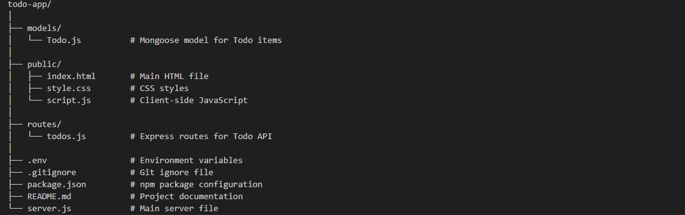

# Todo App

A simple Todo application built with Node.js, Express, MongoDB, and Mongoose.

## Getting Started

### Prerequisites

- Node.js
- npm
- MongoDB

### Installation

1. Clone the repository
   ```sh
   git clone https://github.com/yourusername/todo.git

2. Navigate to project directory
     ```sh
      cd todo

3. Install dependencies
    ```sh
   npm install

4. Create .env file
MONGODB_URI=your_mongodb_uri

5. Start the server
  ```sh
npm run dev

6. Running the App
 Open your browser and navigate to http://localhost:3001 to see the app in action.

# Project Structure


# API Endpoints
Get all todos
GET /api/todos

# Create a new todo
POST /api/todos

request body:
{
  "title": "New Todo",
  "description": "Todo description",
  "dueDate": "2023-12-31",
  "priority": "high"
}

Update a todo
DELETE /api/todos/:id

Architecture
The Todo app follows a simple MVC (Model-View-Controller) architecture:

Model: Defines the data structure and interacts with the database (Mongoose models).
View: The client-side code (HTML, CSS, JavaScript) that interacts with the user.
Controller: Handles the business logic and routes (Express routes).


## Technologies Used


